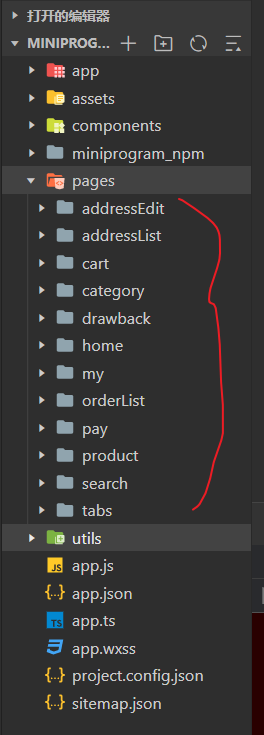

# DatabaseSystem：数据库课设

## 需求分析:拟定技术路线

## 一套后台管理系统+前端商城相结合的数据库管理系统

### 1.数据获取:

**python**

- 代码编辑器:pycharm（学生注册），excel

  

数据处理过程：**？**

### 2.前端界面:

**html+css+javascript**

1.后台管理员登陆系统（基于Jquery+layui+Echarts实现）

- 代码编辑器:hxbuilder

- 数据展示

- 图表展示

2.前端商城(lin-ui组件)

- 代码编辑器:微信小程序开发工具

前端农产品界面

- 首页展示
- 个人界面
- 购物车

### 3.后端开发：

**java**

- springboot框架

- mabatis-plus连接数据库

### 4.数据库系统：

**mysql**

- 数据库管理软件：navicat 

  

- 数据存储：**？**

## 概念结构设计：

### E-R图：

-1619009451954.jpg)

## 项目分工:

### 爬数据：

### 数据库建表：

### 接口设计：

### java实体类：

### 后端设计：刘琪航

### 前端界面：江志健

任务介绍：开发小程序界面

- 完成首页、购物车和我的3个TabBar:和具体页面包括：地址，订单详情，支付（界面为主，不配备api）,商品详情等

- 理清项目页面,配合接口设计人员完善接口文档

  

- 完成后台管理员界面（商家），做到权限分离，只允许管理员用户登陆

- 配合Echarts完成数据分析图表展示
- 
